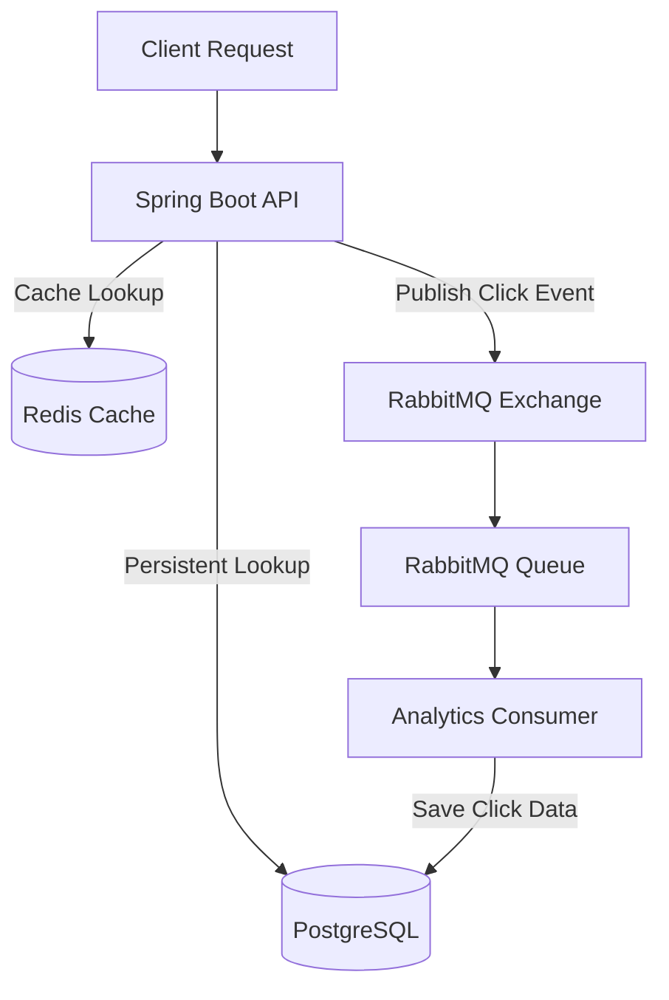

# LinkForge - Enterprise URL Shortener Backend

## 1. Project Overview
LinkForge is a scalable, high-performance URL shortener backend built with Kotlin and Spring Boot 3. It provides fast redirection, robust analytics tracking, rate limiting, and custom domain support, designed to handle high-throughput workloads efficiently.

## 2. Features
* **Shorten URL:** Convert long URLs into concise, shareable short codes using Base62 encoding.
* **Custom Aliases & Domains:** Support for branded links (e.g., `go.brand.com/promo`).
* **Fast Redirection:** Sub-millisecond lookup times utilizing a Redis Cache-Aside architecture.
* **Analytics & Click Tracking:** Asynchronous analytics via RabbitMQ to track unique visitors, referrers, and geographics.
* **Dashboard APIs:** Comprehensive aggregation for URL performance.
* **QR Code Generation:** On-the-fly QR code generation for shortened URLs.
* **Rate Limiting:** IP-based sliding-window rate limiting using Redis Lua scripts.
* **URL Expiration:** TTL-based expiration that automatically cleans up old links.

## 3. Architecture

Below is the high-level architecture diagram of LinkForge:



## 4. Technology Stack
* **Language:** Kotlin 1.9, Java 21
* **Framework:** Spring Boot 3, Spring Data JPA, Spring AMQP
* **Database:** PostgreSQL 16 (via Flyway)
* **Caching & Rate Limiting:** Redis
* **Message Broker:** RabbitMQ
* **Observability:** Micrometer, Spring Boot Actuator
* **Documentation:** SpringDoc OpenAPI 3

## 5. Database Schema
The database consists of three primary tables:
* `domains`: Stores custom domains (`id`, `domain`, `active`).
* `urls`: Stores the URL mappings (`id`, `original_url`, `short_code`, `domain_id`, `expires_at`, `inactive`). Includes composite unique indexes for `(domain_id, short_code)`.
* `click_events`: Stores analytics (`url_id`, `clicked_at`, `ip_hash`, `user_agent`, `referrer`).

## 6. Redirect Flow
1. Client requests `GET /{host}/{shortCode}`.
2. The application intercepts the request and calculates the lookup key.
3. **Redis Cache:** Checks if the URL exists in the cache.
   - *Hit:* Returns a `302 Found` immediately.
   - *Miss:* Queries PostgreSQL. If found, updates the cache asynchronously and returns `302 Found`.
4. If the URL is inactive or expired, a `410 Gone` or `404 Not Found` is returned.

## 7. Redis Caching Flow
LinkForge implements the **Cache-Aside** pattern.
- **Cache Keys:** `url:{domain}:{shortCode}` or `url:{shortCode}`.
- **TTL:** Configurable TTL (default 24h) or exact expiration time if the URL has an explicit `expiresAt`.
- **Serialization:** Lightweight string serialization `"{id}|{originalUrl}"` to minimize overhead.

## 8. RabbitMQ Analytics Flow
To prevent DB write latency from affecting the redirect hot path:
1. `RedirectController` extracts request headers (anonymizing IPs via SHA-256).
2. The data is packaged into a `ClickEventMessage` and published to RabbitMQ asynchronously.
3. `ClickEventConsumer` listens to the queue, batch-reads messages, and persists them into the `click_events` PostgreSQL table.

## 9. Rate Limiting Design
* **Mechanism:** A Redis-backed Sliding Window Log implemented via a custom Lua script.
* **Identity:** Anonymous rate limiting based on hashed IP addresses.
* **Fail-Open Strategy:** If Redis is unavailable, the rate limiter fails *open*, allowing requests to ensure system availability.

## 10. API Documentation
Swagger UI is automatically generated and available when the application is running:
* **URL:** `http://localhost:8080/swagger-ui.html`
* It covers `/api/v1/urls` (Creation, QR) and `/api/v1/analytics` (Dashboard stats).

## 11. Local Setup
1. Ensure Java 21 and Gradle are installed.
2. Clone the repository.
3. Copy the environment template: `cp .env.example .env`.
4. Start infrastructure (see Docker Setup).
5. Run the app: `./gradlew bootRun`

## 12. Docker Setup
To spin up the required infrastructure locally:
```bash
docker-compose up -d
```
This starts PostgreSQL (port 5432), Redis (port 6379), and RabbitMQ (port 5672/15672 for management).

## 13. Environment Variables
* `DB_HOST`, `DB_PORT`, `DB_USER`, `DB_PASSWORD`, `DB_NAME`: Database credentials.
* `REDIS_HOST`, `REDIS_PORT`: Redis coordinates.
* `RABBITMQ_HOST`, `RABBITMQ_USER`, `RABBITMQ_PASSWORD`: RabbitMQ coordinates.
* `CACHE_TTL`: Duration for Redis cache (e.g., `24h`).
* `RATE_LIMIT_ANONYMOUS_REQUESTS`: Max requests per window.
* `SHORTENER_STRATEGY`: `sequential` or `random`.

## 14. Testing
Run the test suite using Gradle:
```bash
./gradlew test
```
The suite includes unit tests for the ShortCode Generator, URL validation, and comprehensive Spring Boot `@SpringBootTest` integration tests for caching, expiration, and rate limiting.

## 15. Performance Considerations
* **Avoided N+1 Queries:** Using `@EntityGraph` when fetching domains.
* **No Transactions on Read:** Cache hits completely bypass Spring's `@Transactional` proxy overhead.
* **Async Metrics & Events:** Publishing to RabbitMQ and updating Micrometer metrics are fully asynchronous to the redirect response.
* **B-Tree Indexes:** Database heavily indexed on `original_url` and `clicked_at` for fast analytic aggregations.

## 16. Design Tradeoffs
* **Eventually Consistent Analytics:** Click tracking is not synchronous. If RabbitMQ or the worker node crashes, there is a minor risk of dropped analytics events, but the redirect functionality remains 100% available.
* **IP Hashing vs Granular Geolocation:** IPs are hashed for privacy, meaning retroactive IP-based geolocation analysis is impossible.
* **Rate Limiting Fail-Open:** Prioritizes uptime over strict limit enforcement during Redis outages.

## 17. Future Improvements
* **gRPC Internal API:** If split into microservices, inter-service communication could use gRPC instead of REST.
* **Testcontainers:** Migration of integration tests to use true isolated Testcontainers for CI/CD consistency.
* **Kafka Migration:** For extreme high-throughput analytics, replacing RabbitMQ with Kafka or Kinesis could provide better stream processing capabilities.
